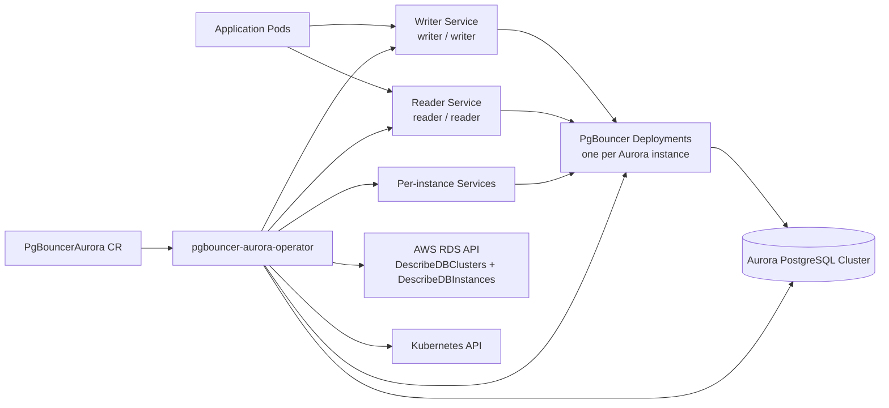
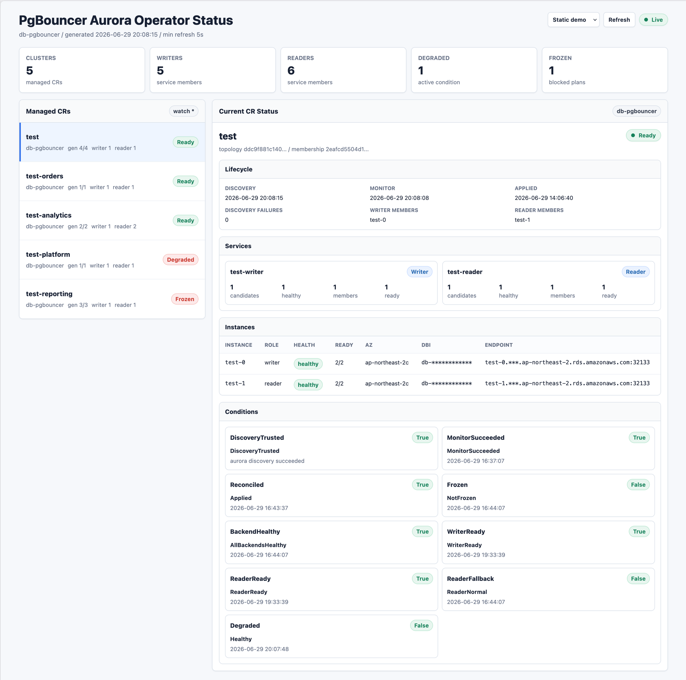

# pgbouncer-aurora-operator

`pgbouncer-aurora-operator` watches Aurora PostgreSQL topology, runs one PgBouncer per DB instance (1:1), and keeps the fixed writer/reader Kubernetes Services that applications point at aligned with the current Aurora roles. Its core value is eliminating the reader connection skew that PgBouncer pooling introduces, and automatically reflecting topology changes such as instance scaling and failover into the connection layer.

> Status: public alpha — `v0.1.0-alpha` (CRD API `v1alpha1`). A multi-arch image (`linux/amd64`, `linux/arm64`) is published on Quay and raw Kubernetes manifests ship under `deploy/`. APIs and manifests may still change before a stable release; a Helm chart is not available yet.

## Why it exists

A typical "PgBouncer in front of Aurora" setup has two limitations.

1. **The Aurora reader endpoint cannot spread a connection pool.** The reader endpoint only picks an instance at connection time (DNS resolution). A long-lived pool connection, once established, is pinned to that instance — so in a pooled environment load skews onto one particular reader (reader connection skew).

2. **Topology changes are not reflected automatically.** Static config or a single cluster endpoint cannot follow instances that change through scale-out, replacement, or promotion. To use a newly added Aurora instance, you have to define the corresponding PgBouncer deployment by hand each time.

This operator watches Aurora topology, updates per-instance writer/reader Kubernetes Service membership through operator-managed Pod labels, and connects each PgBouncer directly to a single Aurora instance (1:1). This fills both gaps — per-instance PgBouncer Pods spread reader load instead of concentrating it on one endpoint, and new instances are automatically joined to the Service of their role.

## What it does



### Key features

- **Automatic Aurora topology sync** — detects instance add/remove and writer failover, and reflects them into writer/reader Service membership.
- **Per-instance 1:1 PgBouncer** — resolves reader connection skew.
- **Fast writer failover detection** — once trusted Discovery confirms the new writer and its PgBouncer Pod is Ready, the writer Service membership is switched first without waiting for the next Monitor success (fast path).
- **zoneAware placement** — places each PgBouncer Pod on a node in the same AZ as its Aurora instance, preferred or required.
- **Safety mechanisms** — last-known-good retention and freeze keep the last verified healthy traffic state when observations are uncertain.
- **Built-in status dashboard** — the operator serves a `/status` web UI and `/status.json` that show managed CRs, topology, writer/reader membership, and conditions at a glance ([Status dashboard](#status-dashboard-status)).

### How it works

- **Discovery**
  - Builds Aurora writer/reader endpoints from `spec.discovery.clusterName`, `spec.discovery.domainName`, and `spec.discovery.port`, then queries `aurora_replica_status()`.
  - If the writer endpoint is briefly unavailable during failover, it immediately retries with the reader endpoint built in the same discovery tick.
  - Determines role from `session_id` (`MASTER_SESSION_ID` = writer).
  - Instance endpoints are generated deterministically as `{instanceName}.{domainName}`.
  - RDS metadata is used only to enrich the AZ for zone-aware scheduling and `DbiResourceId` (physical instance identity); it is not used as the topology source of truth.
  - A failed RDS metadata refresh does not drop a healthy Aurora SQL discovery to untrusted.

- **Rendering**
  - Creates one ConfigMap, Deployment, and Service per discovered Aurora DB instance.
  - Renders PgBouncer `[databases]` as a wildcard route to the corresponding Aurora instance.
  - Creates role Services for writer/reader traffic.
  - Role Services use operator-managed Pod labels as the Kubernetes Service selector.

- **Monitoring**
  - Checks PgBouncer Pod readiness first.
  - Optionally connects directly to the backend DB and checks role/health via `pg_is_in_recovery()` and `transaction_read_only`.
  - Optionally checks the PgBouncer path via the per-instance PgBouncer Service with `select 1`.
  - Applies failure/recovery thresholds before changing healthy Service membership.
  - During writer failover, Discovery is the source of truth for role, and Monitor is treated as a sanity check rather than the primary gate.

- **Topology handling**
  - New Aurora instances get new PgBouncer resources.
  - Removed Aurora instances are first dropped from the role Services, and after retention the per-instance resources are deleted.
  - Zone-aware scheduling can prefer (Preferred) or require (Required) the same AZ as the Aurora instance.

## Scope and configuration (must read)

The value of this operator is "automatic topology reflection." Its responsibility boundary is stated clearly here.

### Not a high-availability (HA) proxy

PgBouncer is a lightweight, high-performance **connection pooler**, not an HA proxy, and this operator does not change that nature. What the operator does is keep the pooling layer always pointed at the instances with the correct roles.

- **The nature of Aurora failover**: at promotion, connections to the old writer are dropped, and any in-flight transactions at that moment fail 100%. This is inherent to Aurora failover regardless of what proxy sits in front.
- **Default behavior is non-destructive**: when the writer changes, the operator only switches Service membership and does not forcibly move already-established app→PgBouncer connections (`writerChangeConnectionHandling: KeepExisting`).
- **Optional connection cleanup**: to drop the stale server connections of an instance whose role changed and induce reconnection, you can set `writerChangeConnectionHandling` to `RestartWriters`/`RestartAll`. Per-instance Deployments use `RollingUpdate(maxUnavailable=0, maxSurge=1)`, so **running with `replicas: 2` or more makes this a rolling restart that avoids taking all PgBouncer replicas for that instance down at once** — Pods are replaced one at a time while the instance keeps serving new connections (existing connections on a restarted Pod are still dropped). With `replicas: 1`, the instance has a brief interruption during the restart. Therefore **`replicas: 2` or more is recommended in production**.

If you need strong zero-downtime HA at the level of preserving connections, consider a layer designed for that purpose, such as Pgpool-II or PgCat.

### What the application is responsible for

Detecting disconnects, reconnecting, retrying, and deciding which role (writer/reader) to use a connection for are **the application's responsibility** and out of scope for this project (Non-goals: HA, zero-downtime failover, in-flight transaction recovery, query-time role selection).

This operator only updates Kubernetes Services and PgBouncer workloads when Aurora topology changes; it does not move already-established app→PgBouncer TCP connections to a different Pod. Existing connections keep using the current PgBouncer process until the application or PgBouncer closes them, or the optional writer-change restart policy drops them.

So the application must configure connection lifetime and reconnection behavior. As a practical starting point, recycle pool connections **every 15 minutes** and then tune to your actual workload. The key is to periodically close and reopen not only idle connections but also in-use ones — so stale topology information does not linger in the pool.

### Recommended application settings

| Item | Recommended |
|---|---|
| Borrow/acquire health check | Validate a connection before handing it to application code. Use a lightweight query like `SELECT 1`, and if the pool separates writer/reader connections, also do an appropriate role check. |
| Periodic idle connection check | Periodically validate idle pool connections to remove broken/abnormal ones before use. |
| Maximum connection lifetime | **15 minutes**. Periodically close and reopen even in-use connections after they return to the pool. |
| Idle timeout | Set a finite idle timeout so unused connections do not survive indefinitely after a topology change. |
| Reconnect/retry | Enable short backoff retries on connection-acquisition failures. Enable automatic transaction retries only when the operation is safe and idempotent. |
| Pool size | Keep the number of backend connections fixed and finite. `number of application instances × pool size` should stay comfortably below the `max_connections` equivalent limit of the DB/PgBouncer. |
| DNS cache TTL | Avoid infinite DNS caching, especially in JVM-based applications. |

### Application connection guide

There are three ways for an application to point at the Services the operator creates. With any of them, the operator reflects failover/scale changes by updating each Service's membership.

**Method 1 — two writer/reader Services as a host-list + `targetServerType` (driver role check)**

```text
postgresql://example-pg-writer.<namespace>.svc.cluster.local:6432,example-pg-reader.<namespace>.svc.cluster.local:6432/db?targetServerType=primary
```

- The driver takes these two Services as a host-list and picks the target directly by role according to `targetServerType` — `primary` attaches to the writer, `secondary`/`preferSecondary` attaches to the reader. The example above is a write connection (`primary`); a read connection uses the same host-list with `secondary`. During the failover transition, whichever Service points at whichever role, the driver re-checks the actual role and follows it.
- The Service names (`<cr-name>-writer`, `<cr-name>-reader`) are fixed and the operator updates membership, so Aurora scale/topology changes are reflected automatically.

**Method 2 — split read/write connections to the reader/writer Service respectively (simplest)**

Point write-only connections at the writer Service and read-only connections at the reader Service.

```text
# write-only datasource
postgresql://example-pg-writer.<namespace>.svc.cluster.local:6432/db
# read-only datasource
postgresql://example-pg-reader.<namespace>.svc.cluster.local:6432/db
```

- This is the most natural setup if the application already splits read/write datasources. It does not require driver host-list or `targetServerType` support.
- Even when the writer changes due to failover, the operator updates the writer Service membership to the new writer, so the application keeps using the same Service address.

**Method 3 — individual instance Services as a host-list**

```text
postgresql://example-pg-reader-1.<namespace>.svc.cluster.local:6432,example-pg-reader-2.<namespace>.svc.cluster.local:6432/db?targetServerType=primary
```

- Listing per-instance Services (`<cr-name>-<dbInstanceIdentifier>`) directly makes the driver iterate over instances to find a valid connection (the same pattern as the AWS docs' "individual DB instance nodes").
- ⚠️ **Aurora scale-out/topology changes are not reflected automatically.** When a new instance appears, you must **manually update** the host-list in the connection string. To get the operator's automatic-reflection benefit, use Method 1 or 2.

> The port follows the PgBouncer `listen_port` (default `6432`). Connect to the port PgBouncer listens on, not the Aurora port (5432).

### Reference: AWS fast failover best practices

Driver-side fast failover settings align with the recommendations in the AWS docs: [Best practices with Amazon Aurora PostgreSQL fast failover](https://docs.aws.amazon.com/AmazonRDS/latest/AuroraUserGuide/AuroraPostgreSQL.BestPractices.FastFailover.html). Key recommended values (examples):

- Aggressive timeouts: `loginTimeout=2`, `connectTimeout=2`, `cancelSignalTimeout=1`, with a low `socketTimeout` for short queries (split long queries into separate connections).
- `tcpKeepAlive=true`, and `loadBalanceHosts=true` when using a host-list.
- DNS TTL under 30 seconds (JVM: `networkaddress.cache.ttl=1`, `networkaddress.cache.negative.ttl=3`).
- Specify the target with `targetServerType` (`primary`/`secondary`/`preferSecondary`/`any`).

The AWS docs recommend "listing individual instance nodes in a host-list" for the best failover, while noting its downside: "requires manual update on topology change." Methods 1 and 2 above (pointing at the writer/reader Services) automate exactly that manual update via the operator, so the application only needs to point at the writer/reader Services.

## Requirements

### Runtime environment

| Component | Version / requirement | Notes |
|---|---|---|
| Kubernetes | `>= 1.27` recommended | Uses `apiextensions.k8s.io/v1`, `apps/v1`, `rbac.authorization.k8s.io/v1`, and standard Service/Pod APIs. Lower versions may work but are not yet targeted. |
| Aurora PostgreSQL | Aurora PostgreSQL with `aurora_replica_status()` | Discovery depends on `select server_id, session_id from aurora_replica_status()`. |
| PgBouncer | `1.25.2` verified | Verified with PgBouncer `1.25.2`; provide your own image (see `spec.pgbouncer.image`). Other versions may work if the config options are compatible. |
| AWS IAM | `rds:DescribeDBClusters`, `rds:DescribeDBInstances` | Needed to look up AZ and `DbiResourceId` when zone-aware placement is enabled. Even if the AWS API refresh fails, Aurora SQL discovery remains the topology source of truth. EKS IRSA recommended. |
| Network | Pod→Aurora connectivity | The operator and PgBouncer Pods must be able to reach the Aurora endpoints/ports. |

### Build / test tools

| Tool | Version / requirement | Notes |
|---|---|---|
| Go | `1.26` | Declared in `go.mod` and the Docker build image. |
| Docker Buildx | Recent Docker Desktop / BuildKit | Needed for local and multi-arch image builds. |
| kubectl | Compatible with the target cluster | Used for manifest dry-run, install, and smoke-test scripts. |
| Bash | A Bash-capable POSIX shell | Needed for `hack/*.sh`. |

## Installation

This installs the published public alpha image with `kubectl`. To build and run your own image instead, see [Build from source](#build-from-source-custom-image).

> **Pre-release.** This is an alpha (`v0.1.0-alpha`); the API and manifests may change before a stable release. Pin the explicit version tag shown below — the `latest` tag is intentionally not published. See [Requirements](#requirements) for the cluster, Aurora, IAM, and network prerequisites.

### 1. Install the operator

```bash
# Set your environment
VERSION=v0.1.0-alpha
NAMESPACE=pgbouncer-aurora
OPERATOR_IMAGE=quay.io/case-88/pgbouncer-aurora-operator:${VERSION}
RAW=https://raw.githubusercontent.com/case-88/pgbouncer-aurora-operator/${VERSION}/deploy

kubectl create namespace ${NAMESPACE}
kubectl apply --server-side -f ${RAW}/crd.yaml
kubectl apply -f ${RAW}/serviceaccount.yaml -f ${RAW}/role.yaml -f ${RAW}/rolebinding.yaml -f ${RAW}/operator.yaml

# The bundled deploy/operator.yaml ships a placeholder image, so point the
# Deployment at the published Quay image:
kubectl -n ${NAMESPACE} set image deploy/pgbouncer-aurora-operator manager=${OPERATOR_IMAGE}
kubectl -n ${NAMESPACE} rollout status deploy/pgbouncer-aurora-operator
```

The bundled manifests are namespaced to `pgbouncer-aurora`; keep `NAMESPACE` set to that value, or edit the manifests' `namespace:` fields to install elsewhere.

### 2. Configure credentials and a PgBouncerAurora resource

The Secret and the CR carry environment-specific values — DB user/password, `userlist.txt`, `clusterName`/`domainName`, the PgBouncer image, and so on — so download them, edit, then apply. Do not apply the raw URLs directly.

```bash
curl -fsSLo /tmp/pgbouncer-aurora-secrets.yaml ${RAW}/secrets.yaml
curl -fsSLo /tmp/pgbouncer-aurora.yaml         ${RAW}/cr.yaml

# Edit both files:
#   secrets.yaml — DB username/password/sslmode and the userlist.txt entries
#   cr.yaml      — discovery clusterName/domainName/port, pgbouncer.image, etc.
$EDITOR /tmp/pgbouncer-aurora-secrets.yaml /tmp/pgbouncer-aurora.yaml

kubectl -n ${NAMESPACE} apply -f /tmp/pgbouncer-aurora-secrets.yaml
kubectl -n ${NAMESPACE} apply -f /tmp/pgbouncer-aurora.yaml
```

See [Configuration](#configuration) for every Secret key and CR field.

### 3. Verify

```bash
kubectl -n ${NAMESPACE} get pgba
kubectl -n ${NAMESPACE} get deploy,svc,pod -l pgbouncer-aurora.io/managed-by=pgbouncer-aurora-operator

# Open the built-in status dashboard
kubectl -n ${NAMESPACE} port-forward deploy/pgbouncer-aurora-operator 8080:8080
# then open http://localhost:8080/status
```

## Configuration

An operator deployment is made up of five parts — the **Custom Resource** that defines what is managed, the **Secret** that holds DB/PgBouncer credentials, the **Operator** manager process, and the **Role Binding** / **Service Account** that grant permissions. The full manifests are under [`deploy/`](deploy/).

### Custom Resource

One `PgBouncerAurora` CR manages one Aurora cluster. The minimal form is below; the full example is in [`deploy/cr.yaml`](deploy/cr.yaml).

```yaml
apiVersion: pgbouncer-aurora.io/v1alpha1
kind: PgBouncerAurora
metadata:
  name: example-pg
spec:
  discovery:
    clusterName: example-pg
    domainName: xxxx.ap-northeast-2.rds.amazonaws.com
    port: 5432
    authSecretRef:
      name: pgbouncer-operator-db-auth
  pgbouncer:
    image: <your-registry>/pgbouncer:1.25.2
    authFileSecretRef:
      name: pgbouncer-userlist
```

#### CRD names

| Item | Value |
|---|---|
| API group | `pgbouncer-aurora.io` |
| Version | `v1alpha1` |
| Kind | `PgBouncerAurora` |
| Plural | `pgbouncerauroras` |
| Short name | `pgba` |
| Scope | Namespaced |

#### `spec.discovery`

| Option | Required | Default | Unit | Description |
|---|---:|---|---|---|
| `spec.discovery.clusterName` | Yes | none | string | Aurora DB cluster identifier prefix used to build cluster endpoints. e.g. `example-pg`. |
| `spec.discovery.domainName` | Yes | none | DNS suffix | Common Aurora endpoint suffix. e.g. `xxxx.ap-northeast-2.rds.amazonaws.com`. |
| `spec.discovery.port` | No | `5432` | TCP port | Port for the generated writer/reader/instance endpoints. |
| `spec.discovery.clusterEndpoints.writer.host` | Advanced | generated | DNS name | Explicit writer endpoint override. |
| `spec.discovery.clusterEndpoints.writer.port` | Advanced | `spec.discovery.port` | TCP port | Explicit writer endpoint port override. |
| `spec.discovery.clusterEndpoints.reader.host` | Advanced | generated | DNS name | Explicit reader endpoint override. |
| `spec.discovery.clusterEndpoints.reader.port` | Advanced | `spec.discovery.port` | TCP port | Explicit reader endpoint port override. |
| `spec.discovery.database` | No | `postgres` | database name | Database used for the discovery connection. |
| `spec.discovery.authSecretRef.name` | Yes | none | Secret name | Operator DB credential Secret. Used for Aurora discovery, the direct DB monitor probe, and the PgBouncer path probe. |
| `spec.discovery.interval` | No | `3s` | Go duration | Minimum interval for Aurora topology discovery checks. Internal floor `1s`. |
| `spec.discovery.metadataRefreshInterval` | No | `1m` | Go duration | Minimum interval for the auxiliary RDS AZ/`DbiResourceId` metadata refresh. Intentionally decoupled from the Aurora role discovery interval. |
| `spec.discovery.timeout` | No | `3s` | Go duration | Timeout for discovery DB queries. |
| `spec.discovery.failureThreshold` | No | `3` | count | Number of consecutive untrusted discoveries allowed before freezing instead of using cached topology. |

Endpoint generation rules:

- writer endpoint: `{clusterName}.cluster-{domainName}`
- reader endpoint: `{clusterName}.cluster-ro-{domainName}`
- instance endpoint: `{dbInstanceIdentifier}.{domainName}`

`spec.discovery.interval` defaults to `3s` to follow Aurora failover quickly. This only raises the Aurora topology query frequency. AWS RDS metadata calls for the auxiliary AZ/`DbiResourceId` data are controlled separately by `spec.discovery.metadataRefreshInterval`, which defaults to `1m`. An RDS API failure only degrades zone-aware placement and physical-identity freshness; it does not invalidate a healthy `aurora_replica_status()` topology.

The operator does not infer the AWS region from `spec.discovery.domainName`. RDS metadata lookups use the operator process flag `--aws-region`, so this region must match the region of the Aurora cluster that `domainName` points at. For multi-region operation, run a separate operator deployment per region.

#### `spec.monitor`

| Option | Required | Default | Unit | Description |
|---|---:|---|---|---|
| `spec.monitor.interval` | No | `10s` | Go duration | Minimum interval for monitor checks. Internal floor `1s`. |
| `spec.monitor.timeout` | No | `3s` | Go duration | Timeout per backend monitor probe. |
| `spec.monitor.failureThreshold` | No | `3` | count | Consecutive failures before treating a healthy backend as unhealthy. |
| `spec.monitor.recoveryThreshold` | No | `2` | count | Consecutive successes before treating an unhealthy backend as healthy. |
| `spec.monitor.maxConcurrency` | No | `4` | concurrent probes | Maximum number of backend monitor probes running at once. |
| `spec.monitor.directDBProbe` | No | `true` | boolean | If true, connect directly to the Aurora instance and check role/health via `pg_is_in_recovery()` and `transaction_read_only`. |
| `spec.monitor.pgbouncerPathProbe` | No | `true` | boolean | If true, run `select 1` via the per-instance PgBouncer Service with `sslmode=disable`. |
| `spec.monitor.directDBSSLMode` | No | discovery Secret `sslmode` | PostgreSQL SSL mode | SSL mode used only for the direct Aurora instance probe. |

The two probes work as follows. If both are turned off (`false`), the backend is treated as unhealthy with the reason `no monitor probes enabled`.

- **direct DB probe** — connects directly to the Aurora instance to check health/role. The connection DB is `spec.discovery.database` (default `postgres`), and the SSL mode follows the discovery Secret's `sslmode`.
- **PgBouncer path probe** — checks that it can reach the backend through PgBouncer.
  - The operator automatically injects a dedicated alias `pgbouncer_aurora_probe` into `[databases]`, and the probe connects via this alias. It is not affected by the user-defined `[databases]` `*`, other DB aliases, or `user` settings.
  - This alias is injected only when `pgbouncerPathProbe` is enabled, and it actually connects to `spec.discovery.database` (default `postgres`).
  - Since PgBouncer usually listens without TLS inside the cluster, this probe always connects with `sslmode=disable`.

To enable `pgbouncerPathProbe`, the user in `spec.discovery.authSecretRef` must (1) also exist in the PgBouncer `userlist.txt` Secret and (2) be able to run the probe query on the backend DB. Because `auth_file` is a single file, the operator does not automatically merge the user's `userlist.txt` with the discovery Secret.

#### `spec.pgbouncer`

| Option | Required | Default | Unit | Description |
|---|---:|---|---|---|
| `spec.pgbouncer.image` | Yes | empty | image reference | Required; no default. This project does not ship a PgBouncer image. Build your own PgBouncer image and host it on a registry your cluster can pull from (e.g. Amazon ECR), or use a third-party hub image. |
| `spec.pgbouncer.replicas` | No | `1` | replicas | Default replica count for the per-instance PgBouncer Deployment. |
| `spec.pgbouncer.config` | No | `{}` | PgBouncer config section | Structured PgBouncer config. See below. |
| `spec.pgbouncer.instanceOverrides[]` | No | `[]` | list | Per-Aurora-instance replicas/config overrides. |
| `spec.pgbouncer.authFileSecretRef.name` | Yes | none | Secret name | Secret holding `userlist.txt`. Mounted at the default `auth_file` path `/etc/pgbouncer/userlist.txt`, or at the effective `[pgbouncer].auth_file` path when overridden. |
| `spec.pgbouncer.resources` | No | `{}` | Kubernetes `ResourceRequirements` | CPU/memory requests/limits for the main PgBouncer container. |
| `spec.pgbouncer.labels` | No | `{}` | map[string]string | Extra labels on the generated PgBouncer Pod template. Operator-managed labels win on conflict. |
| `spec.pgbouncer.annotations` | No | `{}` | map[string]string | Extra annotations on the generated PgBouncer Pod template. Operator-managed annotations win on conflict. |
| `spec.pgbouncer.serviceAccountName` | No | empty | ServiceAccount name | ServiceAccount used by the PgBouncer Pod when needed. |
| `spec.pgbouncer.nodeSelector` | No | `{}` | map[string]string | PgBouncer Pod nodeSelector. |
| `spec.pgbouncer.affinity` | No | `{}` | Kubernetes `Affinity` | node/pod affinity/anti-affinity. Zone-aware affinity is still operator-managed. |
| `spec.pgbouncer.tolerations` | No | `[]` | list | Pod tolerations. |
| `spec.pgbouncer.priorityClassName` | No | empty | PriorityClass name | PgBouncer Pod priority class. |
| `spec.pgbouncer.runtimeClassName` | No | empty | RuntimeClass name | PgBouncer Pod runtime class. |
| `spec.pgbouncer.podSecurityContext` | No | `{}` | Kubernetes `PodSecurityContext` | Pod-level security context. |
| `spec.pgbouncer.containerSecurityContext` | No | `{}` | Kubernetes `SecurityContext` | Security context for the main `pgbouncer` container. |
| `spec.pgbouncer.livenessProbe` | No | `config.pgbouncer.listen_port` TCP probe | Kubernetes `Probe` | Main-container liveness probe override. Use with care. |
| `spec.pgbouncer.readinessProbe` | No | `config.pgbouncer.listen_port` TCP probe | Kubernetes `Probe` | Main-container readiness probe override. Affects Service membership and monitor behavior. |
| `spec.pgbouncer.sidecars` | No | `[]` | container list | Extra sidecar containers. |
| `spec.pgbouncer.volumes` | No | `[]` | volume list | Extra volumes. Operator-managed `config`/`auth-file` volumes win on conflict. |
| `spec.pgbouncer.volumeMounts` | No | `[]` | volume mount list | Extra mounts on the main `pgbouncer` container. Operator-managed mounts win on conflict. |
| `spec.pgbouncer.imagePullSecrets` | No | `[]` | Kubernetes `LocalObjectReference[]` | Image pull secrets added to the PgBouncer Pod. |
| `spec.pgbouncer.topologySpreadConstraints` | No | `[]` | Kubernetes `TopologySpreadConstraint[]` | Native Pod topology spread. Use this instead of an operator-specific policy for replica spreading. |

`spec.pgbouncer.config` maps directly to PgBouncer ini sections:

| Option | Required | Default | Description |
|---|---:|---|---|
| `spec.pgbouncer.config.pgbouncer` | No | `{auth_type: md5, auth_file: /etc/pgbouncer/userlist.txt, listen_addr: 0.0.0.0, listen_port: 6432}` | Rendered as `[pgbouncer]`. `listen_port` is the source of truth for the container port, Services, and probes. `listen_addr`, `auth_file`, and `pidfile` can also be set here. |
| `spec.pgbouncer.config.databases` | No | `{"*": {}}` | Rendered as `[databases]`. Each key is a database entry name. `host`/`port` are operator-managed per Aurora instance and ignored if provided. `pgbouncer_aurora_probe` is a monitor reserved alias, so when the path probe is enabled it overrides any user setting with the operator value. |
| `spec.pgbouncer.config.users` | No | `{}` | Rendered as `[users]`. |
| `spec.pgbouncer.config.peers` | No | `{}` | Rendered as `[peers]`. |

Operator-managed PgBouncer keys:

| Key | Value | Description |
|---|---|---|
| `[pgbouncer].listen_addr` | `spec.pgbouncer.config.pgbouncer.listen_addr` or `0.0.0.0` | The operator provides a default and it can be overridden. |
| `[pgbouncer].listen_port` | `spec.pgbouncer.config.pgbouncer.listen_port` or `6432` | An allowed config key used by the generated resources. |
| `[pgbouncer].auth_file` | `spec.pgbouncer.config.pgbouncer.auth_file` or `/etc/pgbouncer/userlist.txt` | The operator provides a default and it can be overridden. The `authFileSecretRef` Secret is automatically mounted at the effective path. |
| `[pgbouncer].pidfile` | `spec.pgbouncer.config.pgbouncer.pidfile` | Optional PgBouncer key rendered only when set. |
| `[databases].*.host` | Aurora instance endpoint | Rendered by the operator, not overridable. |
| `[databases].*.port` | Aurora instance port | Rendered by the operator, not overridable. |
| `[databases].pgbouncer_aurora_probe` | `host=<instance endpoint> port=<instance port> dbname=<spec.discovery.database or postgres>` | Reserved alias for the monitor path probe. `host`/`port` are operator-managed just like the per-instance route; rendered by the operator when `pgbouncerPathProbe` is effectively true, not overridable. |

The operator does not validate arbitrary PgBouncer config keys.
Except for the operator-managed keys above and parsing `listen_port` for the Kubernetes Service/container/probe ports, every provided `key: value` is rendered as-is into `pgbouncer.ini`.
Invalid PgBouncer config is expected to fail at PgBouncer startup, not at CR admission time.

#### `spec.pgbouncer.instanceOverrides[]`

| Option | Required | Default | Unit | Description |
|---|---:|---|---|---|
| `spec.pgbouncer.instanceOverrides[].name` | Yes | none | Aurora DB instance identifier | Matches `server_id` from `aurora_replica_status()`. |
| `spec.pgbouncer.instanceOverrides[].replicas` | No | `spec.pgbouncer.replicas` | replicas | PgBouncer Deployment replica count for that instance. |
| `spec.pgbouncer.instanceOverrides[].config` | No | `{}` | PgBouncer config section | Deep-merged on top of `spec.pgbouncer.config` for that instance. |

#### `spec.services`

| Option | Required | Default | Unit | Description |
|---|---:|---|---|---|
| `spec.services.writer.name` | No | `writer` | DNS label suffix | Name suffix of the writer-traffic role Service. The final name is `<cr-name>-<name>`. |
| `spec.services.writer.type` | No | `ClusterIP` | Kubernetes Service type | Writer role Service type. One of `ClusterIP`/`NodePort`/`LoadBalancer`. |
| `spec.services.writer.annotations` | No | `{}` | map[string]string | Writer role Service annotations. |
| `spec.services.reader.name` | No | `reader` | DNS label suffix | Name suffix of the reader-traffic role Service. The final name is `<cr-name>-<name>`. |
| `spec.services.reader.type` | No | `ClusterIP` | Kubernetes Service type | Reader role Service type. One of `ClusterIP`/`NodePort`/`LoadBalancer`. |
| `spec.services.reader.annotations` | No | `{}` | map[string]string | Reader role Service annotations. |
| `spec.services.perInstances.type` | No | `ClusterIP` | Kubernetes Service type | Type of every per-instance PgBouncer Service. One of `ClusterIP`/`NodePort`/`LoadBalancer`. |
| `spec.services.perInstances.annotations` | No | `{}` | map[string]string | Annotations for each per-instance Service. |

Because the monitor path probe and direct targeting depend on per-instance Services, a per-instance Service is always created for discovered instances.

#### `spec.topologyPolicy`

| Option | Required | Default | Unit | Description |
|---|---:|---|---|---|
| `spec.topologyPolicy.removeAfterMissingCount` | No | `3` | discovery observations | Number of consecutive trusted discovery cycles an instance must be missing before becoming a removal candidate from retained membership. |
| `spec.topologyPolicy.removedInstanceRetention` | No | `1h` | Go duration | How long to retain a removed instance's ConfigMap/Deployment/Service before deletion. |
| `spec.topologyPolicy.writerChangeConnectionHandling` | No | `KeepExisting` | enum | Behavior on writer membership change. One of `KeepExisting`/`RestartWriters`/`RestartAll`. |
| `spec.topologyPolicy.readerEmptyFallback.enabled` | No | `true` | boolean | Whether to temporarily route reader Service traffic to the writer when there is no healthy reader. If off, leave the reader membership empty. |
| `spec.topologyPolicy.zoneAware.enabled` | No | `true` | boolean | Whether to add node affinity based on the Aurora instance AZ. |
| `spec.topologyPolicy.zoneAware.enforcement` | No | `Preferred` | enum | `Preferred` adds preferred node affinity, `Required` adds required node affinity. |
| `spec.topologyPolicy.zoneAware.topologyKey` | No | `topology.kubernetes.io/zone` | node label key | Node label key used for zone-aware scheduling. |
| `spec.topologyPolicy.zoneAware.conflictPolicy` | No | `Warn` | enum | Policy when user scheduling constraints conflict with the zone-aware intent. One of `Warn`/`Fail`/`Ignore`. `Warn` records a condition and continues, `Fail` freezes reconcile for safety, `Ignore` hides the conflict condition. |

### Secret

The operator DB auth Secret referenced by `spec.discovery.authSecretRef` uses the keys below. The same credentials are used for Aurora discovery, the direct DB monitor probe, and the PgBouncer path probe.

| Key | Required | Default | Unit | Description |
|---|---:|---|---|---|
| `username` or `user` | Yes | none | string | PostgreSQL user used for discovery and monitor probe queries. |
| `password` | Yes | none | string | PostgreSQL password. |
| `sslmode` or `ssl_mode` | No | `require` | string | PostgreSQL SSL mode used by the Go `pgx` driver. |

The PgBouncer auth file Secret referenced by `spec.pgbouncer.authFileSecretRef`:

| Key | Required | Default | Unit | Description |
|---|---:|---|---|---|
| `userlist.txt` | Yes | none | file content | Mounted at the effective `[pgbouncer].auth_file` path (default `/etc/pgbouncer/userlist.txt`). Uses PgBouncer-compatible password entries. |

### Operator

The operator is a Deployment that watches a single namespace; the default manifest uses `replicas: 1` and enables leader election. The default manifest is [`deploy/operator.yaml`](deploy/operator.yaml), and the watch target is set by `--watch-namespace` (defaults to the operator Pod's namespace) and `--watch-name` (defaults to `*`, all CRs in that namespace).

> [!IMPORTANT]
> **Recommended deployment unit — up to 4–5 CRs per operator**
>
> A single operator can comfortably manage up to 4–5 CRs without load issues. (Beyond that has not been tested yet.) You can narrow an operator to watch a specific CR with `--watch-name`.

#### Operator flags

These are manager process flags, not CR options.

| Flag | Default | Unit | Description |
|---|---|---|---|
| `--metrics-bind-address` | `:8080` | address | Metrics bind address. |
| `--health-probe-bind-address` | `:8081` | address | health/readiness probe bind address. |
| `--leader-elect` | `false` | boolean | Enable controller-runtime leader election. The default manifest passes this flag. |
| `--aws-region` | `""` | AWS region | Single AWS region for RDS metadata lookups. Must match the Aurora region the managed CRs use. The default manifest sets `ap-northeast-2`. |
| `--watch-namespace` | `WATCH_NAMESPACE` | namespace | Namespace the manager watches. Required. Cluster-wide watch is not supported. The default manifest uses the operator Pod namespace. |
| `--watch-name` | `WATCH_NAME` | CR name | Optional `PgBouncerAurora` name filter. Empty/`*` watches all CRs in `--watch-namespace`; a specific name watches only that CR. |
| `--max-concurrent-reconciles` | `1` | reconciles | Maximum concurrent `PgBouncerAurora` reconciles. |
| `--reconcile-min-interval` | `RECONCILE_MIN_INTERVAL` or `1s` | Go duration | Minimum interval between heavy reconciles for the same CR. Event-driven reconciles within this window are throttled and requeued after the remaining time. |
| `--resync-period` | `RESYNC_PERIOD` or `60s` | Go duration | controller-runtime cache resync period. A safety net, not the writer discovery/monitor polling mechanism. |
| `--rds-metadata-cache-ttl` | `1m` | Go duration | Cache TTL for successful RDS DB instance metadata. |
| `--aws-api-qps` | `AWS_API_QPS` or `2` | requests/sec | Global AWS API rate limit used by RDS metadata discovery. |
| `--aws-api-burst` | `AWS_API_BURST` or `5` | requests | Global AWS API rate limit burst. |
| `--db-probe-qps` | `DB_PROBE_QPS` or `20` | probes/sec | Global DB probe rate limit used by monitor probes. |
| `--db-probe-burst` | `DB_PROBE_BURST` or `40` | probes | Global DB probe rate limit burst. |
| `--monitor-job-timeout` | `MONITOR_JOB_TIMEOUT` or `8s` | Go duration | Whole monitor job timeout. The per-probe timeout follows `spec.monitor.timeout`. |
| `--scheduler-tick` | `SCHEDULER_TICK` or `1s` | Go duration | Central scheduler scan interval for due discovery/monitor checks. |
| `--discovery-workers` | `DISCOVERY_WORKERS` or `2` | workers | Number of bounded discovery workers. |
| `--monitor-workers` | `MONITOR_WORKERS` or `4` | workers | Number of bounded monitor workers. |
| `--status-refresh-min-interval` | `STATUS_REFRESH_MIN_INTERVAL` or `5s` | Go duration | Minimum refresh interval for the cached snapshot the `/status` dashboard shows. |
| `--status-recent-window` | `STATUS_RECENT_WINDOW` or `1m` | Go duration | Time window used to highlight recently changed `/status` items. Values are clamped to `1m`–`24h`. |
| `--zap-devel` | `false` | boolean | Enable development-mode logging. |

### Role Binding

The operator runs only within its own namespace via a namespaced **Role** ([`deploy/role.yaml`](deploy/role.yaml)) — not a ClusterRole, and it does not access resources in other namespaces. A **RoleBinding** ([`deploy/rolebinding.yaml`](deploy/rolebinding.yaml)) binds this Role to the operator ServiceAccount.

Permissions the Role grants:

| Resource | Verbs | Purpose |
|---|---|---|
| `pgbouncerauroras`, `.../status`, `.../finalizers` | get, list, watch, update, patch | Watch the CR and update status/finalizers. |
| `apps/deployments` | get, list, watch, create, update, patch, delete | Manage per-instance PgBouncer Deployments. |
| `services`, `configmaps` | get, list, watch, create, update, patch, delete | Manage role/instance Services and PgBouncer config. |
| `pods` | get, list, watch, patch | Service membership labeling. |
| `secrets` | get | Read DB auth/userlist Secrets. |
| `coordination.k8s.io/leases` | get, list, watch, create, update, patch, delete | Leader election. |
| `events` | create, patch, update | Record reconcile events. |

### Service Account

The operator Pod runs as the `pgbouncer-aurora-operator` ServiceAccount ([`deploy/serviceaccount.yaml`](deploy/serviceaccount.yaml)) and gets its permissions only through the RoleBinding above. The PgBouncer Pod's ServiceAccount is separate and set, when needed, via `spec.pgbouncer.serviceAccountName` (unset by default).

## Status dashboard (/status)

The operator provides a built-in web dashboard to view runtime state at a glance. It is served directly by the operator process, with no separate deployment.



| Path | Content |
|---|---|
| `/status` | Human-facing HTML dashboard |
| `/status.json` | Machine-readable JSON of the same data |

- **Where it is served** — it rides on the metrics server, so it is reachable on `--metrics-bind-address` (default `:8080`). For a quick check, run `kubectl -n <namespace> port-forward deploy/pgbouncer-aurora-operator 8080:8080` and open `http://localhost:8080/status` in a browser.
- **Refresh interval** — the dashboard shows a cached snapshot, whose minimum refresh interval is controlled by `--status-refresh-min-interval` (default `5s`).
- **Recent-change highlight** — summary cards, Managed CR rows, and Conditions are highlighted when `lastAppliedTime` or condition `lastTransitionTime` falls within `--status-recent-window` (default `1m`, clamped to `1m`–`24h`). Periodic discovery/monitor timestamps are not used for this highlight.

What it shows:

- **Top summary** — number of managed CRs, writer/reader Service member counts, and degraded/frozen CR counts.
- **Managed CRs** — all CRs the operator watches with each one's state (Ready/Degraded/Frozen), generation, and writer/reader counts.
- **Selected CR detail**
  - *Lifecycle* — last discovery/monitor/applied times, consecutive discovery failures, and current writer/reader members.
  - *Services* — candidates/healthy/members/ready counts per writer/reader role Service.
  - *Instances* — role/health/ready/AZ/`DbiResourceId`/endpoint per instance.
  - *Conditions* — `DiscoveryTrusted`, `MonitorSucceeded`, `Reconciled`, `Frozen`, `BackendHealthy`, `WriterReady`, `ReaderReady`, `ReaderFallback`, `Degraded`, and so on.

> [!WARNING]
> `/status` and `/status.json` have **no authentication** and expose topology information such as Aurora endpoints and instance identifiers as-is. Do not expose the metrics/status port to outside the cluster or to untrusted networks; restrict access with a NetworkPolicy or `port-forward`.

## Zone-aware placement

If an Aurora instance and the PgBouncer Pod that serves it are in different AZs, you incur cross-AZ latency and data transfer cost. Zone-aware placement reduces this by putting each PgBouncer Pod on a node in the same AZ as its Aurora instance. It is enabled by default and controlled by `spec.topologyPolicy.zoneAware`.

- **AZ source** — `aurora_replica_status()` has no AZ, so only when zone-aware is on does the operator enrich each instance's AZ via RDS `DescribeDBClusters`/`DescribeDBInstances`. This metadata is only a placement hint, not the topology source of truth, and a lookup failure does not block instance add/remove itself.
- **enforcement** — `Preferred` (default) generates `preferredDuringSchedulingIgnoredDuringExecution` nodeAffinity, while `Required` generates `requiredDuringSchedulingIgnoredDuringExecution` nodeAffinity. The default is Preferred so that the Pod still schedules and avoids a DB-connection outage even when no same-AZ node exists. Use `Required` when strongly steering node creation in a specific AZ via Karpenter or similar, but be aware the Pod may stay Pending if the NodePool/subnet/AZ constraints do not align.
- **Relationship with user scheduling constraints** — zone-aware is additive to existing settings and does not replace user-specified `nodeSelector`, `affinity`, or `topologySpreadConstraints`. The operator detects common cases that may conflict with the zone-aware intent — a strict `nodeSelector`, a required `nodeAffinity`, or zone pinning + topology spread on the same key — and handles them per `conflictPolicy` (`Warn`/`Fail`/`Ignore`). It cannot prove every scheduler outcome, so also monitor the Kubernetes scheduling state.
- **Replica spreading** — to spread the PgBouncer replicas of the same Aurora instance across nodes, use the native `spec.pgbouncer.topologySpreadConstraints` (there is no operator-specific `replicaSpread` option). The roles are split: zone nodeAffinity handles AZ alignment, and topologySpreadConstraints handles replica spreading.

## Writer/Reader Service membership convergence performance

This operator's performance metric is "how fast an Aurora role/topology change is reflected into writer/reader Service membership." Overall failover performance cannot be described by a single number — role/topology change, Service membership update, and application query recovery are different stages.

This operator focuses on making the Service membership update stage explicit and fast:

```text
Aurora writer/reader role change
→ operator discovery
→ writer/reader Service membership update
→ EndpointSlice update
→ PgBouncer backend reconnect
→ application reconnect / pool recycle
```

> These numbers are the **convergence speed** of Service membership, not a zero-downtime guarantee for already-established connections or in-flight transactions. Connection/transaction recovery is the application responsibility described in the [Scope and configuration](#scope-and-configuration-must-read) section above.

In testing, the operator-managed Kubernetes Service generally converged faster, on a fresh-connection basis, than waiting directly on the Aurora cluster endpoint, while an NLB-backed Service added target propagation time. This is expected — the internal Service path is updated via Kubernetes EndpointSlice, whereas an external NLB also depends on target health-check and deregistration behavior.

For the NLB-backed measurements, the writer/reader Services were tuned with annotations that minimize NLB target deregistration and propagation latency — a short deregistration delay with connection termination on deregister, plus cross-zone balancing:

```yaml
# spec.services.writer / spec.services.reader
type: LoadBalancer
annotations:
  service.beta.kubernetes.io/aws-load-balancer-type: external
  service.beta.kubernetes.io/aws-load-balancer-nlb-target-type: ip
  service.beta.kubernetes.io/aws-load-balancer-scheme: internal
  service.beta.kubernetes.io/aws-load-balancer-target-group-attributes: deregistration_delay.timeout_seconds=10,deregistration_delay.connection_termination.enabled=true,load_balancing.cross_zone.enabled=true
  service.beta.kubernetes.io/aws-load-balancer-attributes: load_balancing.cross_zone.enabled=true
```

In production, measure at least the following three paths separately:

| Path | What it tells you |
|---|---|
| Aurora direct | Baseline Aurora endpoint behavior. |
| Kubernetes Service | In-cluster operator/EndpointSlice convergence. |
| NLB | External LoadBalancer propagation and target health behavior. |

Fresh connections alone are not enough for application-perspective recovery. Applications using long-lived pools must be tested with an app-like reconnection flow: an existing connection fails or returns the wrong role → the pool discards it → a new connection is established → a query succeeds on the expected writer/reader role.

### Topology change cases

Beyond failover, common operational topology-change cases were measured.

| Case | Expected behavior | Observed result | Response time |
|---|---|---|---|
| Writer deletion + failover | Remove the old writer from the Service and switch to the new writer | The writer Service switches to the new writer, and the instance being deleted is also excluded from the reader Service | Topology event handling and Service membership apply are roughly 100–200ms. Fresh-query recovery is also affected by DB failover/backend reconnect |
| Reader addition | Prepare the new reader resource, but do not put it into the reader Service until monitor/readiness passes | While two readers are added consecutively, they are not put in immediately but added to the reader Service in ready order | New reader discovery follows the `aurora_replica_status()` discovery cycle. Added sequentially after readiness, apply ~100–200ms |
| Reader deletion | Exclude the deleted reader from the reader Service, and clean up per-instance resources per the retention policy | Excluded from the reader Service immediately once the discovery/missing-count policy is reflected | Excluded right after deletion detection, apply ~80ms |
| All readers removed | Temporarily join the writer via `readerEmptyFallback` so the reader Service is not empty | Once usable readers reach 0, the reader Service is temporarily corrected to the writer instance | While reader candidates are 0, the reader Service is not emptied and points at the fallback writer. Once a real reader is ready, the fallback writer is removed |

In these measurements too, the topology source of truth is `aurora_replica_status()`, and RDS metadata is an optional layer that enriches AZ/`DbiResourceId` only when zoneAware is on. A metadata refresh failure does not make discovery untrusted, and ordinary add/remove proceeds via the discovery/monitor policy.

## Reader Service load balancing

The reader Service delegates connection distribution to the default balancing of the Kubernetes Service (kube-proxy). It is important to understand the characteristics of this distribution.

- **Distribution is random, not round-robin.** kube-proxy's default iptables mode picks a backend probabilistically at each connection-establishment time (statistic mode random). So the unit of distribution is the connection, and once established a connection is pinned to that reader instance until it closes.
- **Small samples can skew.** Random distribution is independent trials, so with few connections (within a few multiples of the instance count) load can skew onto a particular reader. In a long-lived connection pool, this initial distribution tends to persist.
- **In real production, however, it usually distributes evenly.** Applications typically run pools of dozens of connections per instance, with dozens to hundreds of such instances running at once. Since the total connection count comfortably exceeds the reader instance count, random distribution statistically converges to uniform.
- **For stricter distribution, consider IPVS mode.** Switching kube-proxy to IPVS mode lets you use the `rr` (round-robin) or `lc` (least-connection) scheduler for more even distribution even in low-connection ranges.

> This distribution is per connection, not per query. This project's scope is connection distribution across reader instances; it does not provide per-query load balancing.

## Resource label management

Generated PgBouncer resources carry both project-specific labels and the recommended Kubernetes app labels:

| Label | Value |
|---|---|
| `pgbouncer-aurora.io/managed-by` | `pgbouncer-aurora-operator` |
| `pgbouncer-aurora.io/cluster` | Safe label value derived from the CR name |
| `pgbouncer-aurora.io/instance` | Aurora DB instance identifier |
| `app.kubernetes.io/name` | `pgbouncer-aurora` |
| `app.kubernetes.io/component` | `pgbouncer` |
| `app.kubernetes.io/instance` | Safe label value derived from the CR name |
| `app.kubernetes.io/managed-by` | `pgbouncer-aurora-operator` |
| `app.kubernetes.io/part-of` | `pgbouncer-aurora` |

## Development

```bash
# full local checks
./hack/check.sh

# including the Docker build
DOCKER=true ./hack/check.sh

# race detector
go test -race -count=1 ./...
```

The smoke script is designed to be safe by default. `./hack/smoke-test.sh` only validates the raw manifests locally unless you pass `APPLY=true`. For Kubernetes API-server validation without creating resources, use `DRY_RUN=server VALIDATE=true ./hack/smoke-test.sh`.

### Build from source (custom image)

The public install uses the published Quay image, so you do not need to build anything to run the operator. To run your own image — for development or a private registry — build and push a multi-arch image, then point the Deployment at it instead of the Quay image:

```bash
docker buildx build --platform linux/amd64,linux/arm64 \
  -t <registry>/pgbouncer-aurora-operator:<tag> \
  --push .

kubectl -n pgbouncer-aurora set image deploy/pgbouncer-aurora-operator \
  manager=<registry>/pgbouncer-aurora-operator:<tag>
```

## Contributing

Contributions are welcome. The process is intentionally simple for now:

1. For non-trivial behavior changes, open an issue first or draft the intended change.
2. Keep changes small and focused.
3. Add/update tests for controller/discovery/monitor/planner/render behavior.
4. Run `./hack/check.sh` before a PR.
5. Update the README when CRD options or user-visible behavior change.

## License

This project is distributed under the ISC License. See [LICENSE](LICENSE).
